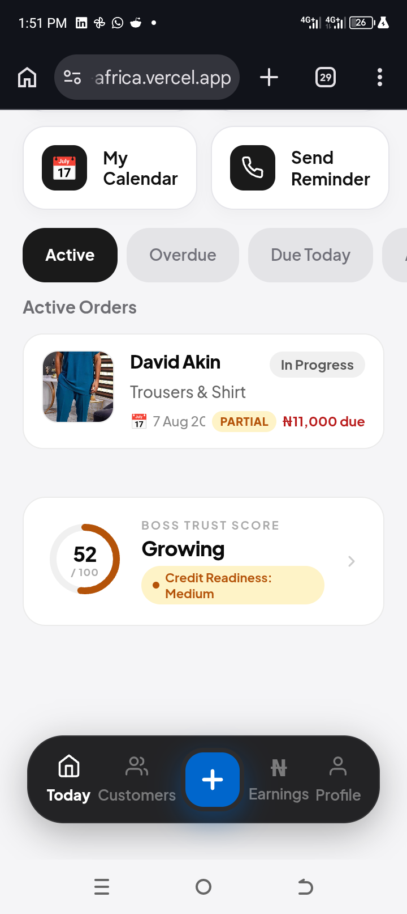
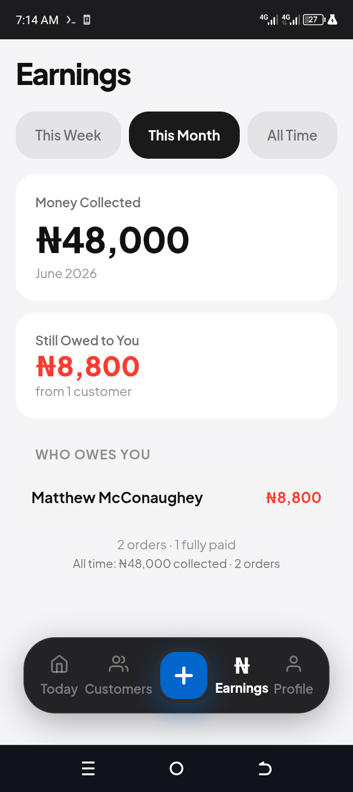
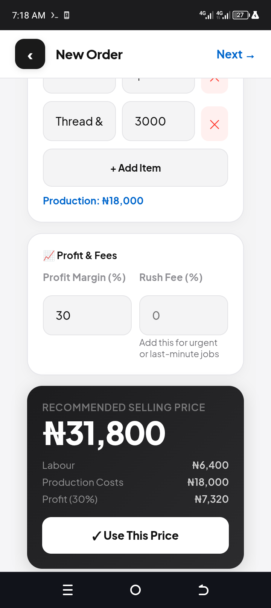

# BOSS — Business Operating System
## Build Trust. Grow Faster.
### A SaaS Product by Monoversal Hub

> From Hustle to BOSS.

BOSS is an **Economic Legitimacy Infrastructure** for informal businesses in Africa.
It helps tailors (and other artisans) become trusted, organised, visible, and bankable.

**Live demo:** [boss-africa.vercel.app](https://boss-africa.vercel.app)

**Screenshots:**


*Real-time trust score, computed from order completion, repeat customers, and payment consistency*

| Smart Pricing Calculator | Earnings |
|---|---|
|  |  |

*(Add screenshots to a `/screenshots` folder in the repo root for these to render.)*

---

## Why BOSS Exists

Most tailors and artisans in Nigeria's informal economy run their business from memory and WhatsApp — no records, no way to prove income, no path to credit. BOSS turns everyday business activity (orders, payments, repeat customers) into a **trust score** that makes an informal business legible to banks, lenders, and customers, without requiring the tailor to change how they already work day-to-day.

## What Makes This Interesting Technically

- **Real-time trust scoring**: the BOS Score is recomputed from live order/payment state — a weighted model across completion rate, repeat customers, payment consistency, and revenue signal — not a static field.
- **State-heavy, flow-based UI**: navigation is built around modal "Flows" (AddOrder, OrderDetail, CustomerDetail, Reminders) layered over a persistent tab shell, with a floating action sheet for entry points — closer to a native app interaction model than typical CRUD screens.
- **Offline-resilient data layer**: `lib/db.js` pairs Supabase with a localStorage cache so the app stays usable on unreliable connections, a real constraint for the target users.
- **Public-facing invoice pages** generated per order, with payment details (bank/crypto) auto-embedded — solving distribution without requiring the customer to have an account.

---

## Project Structure

```
boss-complete/
├── src/
│   ├── app/
│   │   ├── api/
│   │   │   ├── auth/
│   │   │   │   ├── logout/             ← Sign out
│   │   │   │   └── session/            ← Session check
│   │   │   └── invoice/[orderId]/      ← Public invoice page API
│   │   ├── auth/callback/              ← Google OAuth callback
│   │   ├── invoice/[orderId]/          ← Public-facing invoice (receipt only)
│   │   ├── layout.js
│   │   └── page.js
│   ├── components/
│   │   ├── BOSSApp.jsx                 ← Root orchestration
│   │   └── boss/
│   │       ├── AuthScreen.jsx          ← Google OAuth only
│   │       ├── SetupScreen.jsx         ← New tailor onboarding
│   │       ├── SplashScreen.jsx        ← Loading splash
│   │       ├── SmartPricingCalculator.jsx
│   │       ├── helpers.js              ← Pure functions (fmt, getBalance, computeEarnings…)
│   │       ├── tokens.js               ← Design tokens (C, S, CLOTH_TYPES…)
│   │       ├── ui.jsx                  ← Design system (Btn, Input, Flow, Sheet…)
│   │       ├── context.jsx             ← BOSSContext + ErrorBoundary
│   │       ├── cards.jsx               ← TrustScoreCard, OrderCard, StatusStepper…
│   │       ├── index.js                ← Barrel re-exports
│   │       ├── tabs/
│   │       │   ├── TodayTab.jsx        ← Today dashboard
│   │       │   ├── EarningsTab.jsx     ← Financial overview (₦)
│   │       │   ├── CustomersTab.jsx    ← Customer list
│   │       │   └── ProfileTab.jsx      ← Settings, report, backup
│   │       └── flows/
│   │           ├── AddOrderFlow.jsx    ← New order (with style images coming soon)
│   │           ├── AddClientFlow.jsx   ← New client
│   │           ├── OrderDetailFlow.jsx ← Order detail + payments + receipts
│   │           ├── CustomerDetailFlow.jsx
│   │           └── RemindersFlow.jsx
│   └── lib/
│       └── db.js                       ← Data layer (Supabase + localStorage cache)
├── public/
├── supabase-schema.sql                 ← Run once in Supabase SQL editor
├── .env.local.example
├── package.json
└── next.config.js
```

---

## How Payments Work

BOSS does **not** collect payments. The tailor receives money directly.

```
Tailor records a new order:
  → sets price, deposit, delivery date
  → shares WhatsApp receipt with payment details (bank account, crypto address)
  → customer pays via bank transfer, cash, or crypto
  → tailor records payment in the app manually
```

**Payment details on receipts:** The tailor's bank name, account number, and crypto address (if set) are automatically included on WhatsApp receipts and the public invoice page.

---

## Navigation Structure

```
Today | Customers | [+] | Earnings | Profile
              ↑
         Action Sheet:
         ➕ New Order
         👤 New Client
```

---

## Profile Tab — Control Center

| Section | Contents |
|---|---|
| 👤 Edit Profile | Shop name, phone, city, bank details, crypto address |
| 📊 Financial Report | Income summary, order breakdown, top customers, CSV export |
| ☁️ Data & Backup | JSON export, file restore |
| 🧮 Smart Pricing | Calculate job prices (labour + materials + margin) |
| ℹ️ About BOSS | Version, credits |

---

## Authentication

- **Google OAuth only** (via Supabase)
- Email/password authentication has been removed
- No offline/demo mode — all data syncs to Supabase

---

## BOSS Trust Score (BOS Score)

Computed from real business activity. Range: 0–100.

| Factor | Weight |
|---|---|
| Order Completion Rate | 30% |
| Repeat Customers | 25% |
| Payment Consistency | 25% |
| Revenue Signal | 20% |
| Overdue Penalty | −5% per overdue order |

Levels: **New → Building → Growing → Trusted**
Credit Readiness: **Low / Medium / High**

---

## Quick Setup

### 1. Supabase Database

1. Go to [supabase.com](https://supabase.com) → your project → SQL Editor
2. Paste the entire `supabase-schema.sql` → click **Run**
3. Copy your **Project URL** and **anon key** from Settings → API
4. **Enable Google Auth:** Authentication → Providers → Google → enter Client ID + Secret
5. **Run the auto-profile trigger** (block at bottom of schema file) to auto-create tailor rows on signup

### 2. Supabase Storage (for order images)

Create a bucket named `order-images` (public read, authenticated write).

### 3. Environment Variables

```bash
cp .env.local.example .env.local
```

Fill in `.env.local`:

```
NEXT_PUBLIC_SUPABASE_URL=https://YOUR_PROJECT.supabase.co
NEXT_PUBLIC_SUPABASE_ANON_KEY=your-anon-key
SUPABASE_SERVICE_ROLE_KEY=your-service-role-key
NEXT_PUBLIC_APP_URL=https://your-app.vercel.app
```

### 4. Run locally

```bash
npm install
npm run dev
```

Open [http://localhost:3000](http://localhost:3000)

---

## Deploy to Vercel

```bash
git add .
git commit -m "update"
git push origin main
```

Vercel auto-deploys on push. Add all env variables in Vercel → Project → Settings → Environment Variables.

---

## Tech Stack

| Layer | Tool |
|---|---|
| Framework | Next.js 14 (App Router) |
| UI | React 18, inline styles only (no Tailwind, no CSS modules) |
| Database | Supabase (PostgreSQL + Row Level Security) |
| Auth | Google OAuth (via Supabase) |
| Storage | Supabase Storage (order images) |
| Hosting | Vercel |

---

## ENV Variables Reference

| Variable | Source | Required for |
|---|---|---|
| `NEXT_PUBLIC_SUPABASE_URL` | Supabase → Settings → API | Database |
| `NEXT_PUBLIC_SUPABASE_ANON_KEY` | Supabase → Settings → API | Database |
| `SUPABASE_SERVICE_ROLE_KEY` | Supabase → Settings → API | Invoice API (server-only) |
| `NEXT_PUBLIC_APP_URL` | Your Vercel URL | Invoice links |

---

## New Features

- **Financial Report:** Export a CSV of all orders (income, customers, breakdown) from Profile → Financial Report
- **Bank on Receipts:** Your bank account number and crypto address automatically appear on WhatsApp receipts and the public invoice page
- **Crypto Support:** Add a Bitcoin/USDT wallet address in Profile → Edit Profile for receipt inclusion
- **Style Images (coming soon):** Attach up to 5 reference images per order, stored in Supabase Storage
- **Clean Invoice Page:** Public invoice shows receipt + tailor's payment details + WhatsApp contact — no Paystack

---

© 2026 Monoversal Hub. All rights reserved.
BOSS — Build Trust. Grow Faster.
